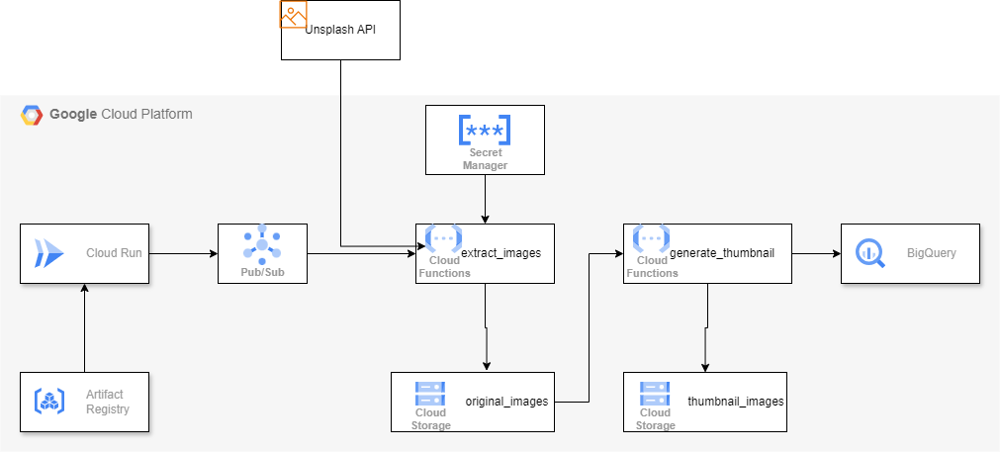

# Image Thumbnail Creation and Analysis

A pipeline created using GCP services which enables user to add any keyword on UI and the related images and its thumbnail will be available in GCS and its metadata info will be accessed through bigquery.



## GCP services used:

### Secret Manager
Sign up for Unsplash API. Get the access key and store it in secret manager with name UNSPLASH_ACCESS_KEY


### Artifact Registry
A docker image of a web application that needs to be hosted on Cloud Run is pushed on Artifact Registry

Create an Artifact Registry Repository
```
  gcloud artifacts repositories create <REPOSITORY_NAME> \
      --repository-format=docker \
      --location=us-central1 \
      --description="My Artifact Repository" 
```

Build,Tag and Push an Artifact
```
docker build -t <IMAGE_NAME> ./cloud_run/
docker tag <IMAGE_NAME> us-central1-docker.pkg.dev/<PROJECT_ID>/<REPOSITORY_NAME>/<IMAGE_NAME>
docker push us-central1-docker.pkg.dev/<PROJECT_ID>/<REPOSITORY_NAME>/<IMAGE_NAME>
```

### Cloud Run
A web application is hosted on Cloud Run which will publish message on PubSub topic.
```
gcloud run deploy <SERVICE_NAME> \
 --image us-central1-docker.pkg.dev/<PROJECT_ID>/<REPOSITORY_NAME>/<IMAGE_NAME> \
 --region us-central1
```

### PubSub
Messages will be published on PubSub, upon which a cloud function gets triggered
```
gcloud pubsub topics create <TOPIC_NAME>
```

### Cloud Storage
Buckets to store images, original as well as thumbnails
```
gcloud storage buckets create gs://<BUCKET_NAME_FOR_ORIGINAL_IMAGES> --location=us-central1
gcloud storage buckets create gs://<BUCKET_NAME_FOR_THUMBNAIL_IMAGES> --location=us-central1
```


### Cloud Function
#### extract_images
It will trigger once a message is published on PubSub. It will download 10 images for that keyword from UnSplash API and will store it in GCS bucket and its information will be stored in Bigquery.
```
gcloud functions deploy extract_images \
  --runtime python312 \
  --entry-point extract_images \
  --trigger-topic <TOPIC_NAME> \
  --source ./cloud_functions/extract_images/ \
  --env-vars-file ./cloud_functions/extract_images/.env.yaml \
  --region us-central1 \
  --service-account=<SERVICE_ACCOUNT>
```

#### generate_thumbnail
It will trigger for every image that is uploaded on GCS bucket and will create a thumbnail for it and store it in GCS bucket and will update the respective record in bigquery.
```
gcloud functions deploy generate_thumbnail \
  --runtime python312 \
  --entry-point generate_thumbnail \
  --trigger-bucket <BUCKET_NAME_FOR_ORIGINAL_IMAGES> \
  --source ./cloud_functions/generate_thumbnail/ \
  --env-vars-file ./cloud_functions/generate_thumbnail/.env.yaml \
  --region us-central1 \
  --service-account=<SERVICE_ACCOUNT>
```

### Bigquery
A bigquery table will contain information like:

unique_id - ID which is unique for every input

keyword - An user input from UI

image_id - ID unique for every image

image_name - Name of the image

thumbnail_url - URL of the thumbnail of the respective image

tags - Every image has multiple tags associated to it on Unsplash. It will store all the tags for that particular image 

processing_datetime - Processing time

#### BQ command to create dataset
```
bq --location=us-central1 mk --dataset <DATASET_ID>
```
#### BQ command to create table
```
bq mk \
--table \
--time_partitioning_field processing_datetime \
--schema unique_id:STRING,keyword:STRING,image_id:STRING,image_name:STRING,thumbnail_url:STRING,tags:STRING,processing_datetime:DATETIME \
<DATASET_ID>.<TABLE_ID>
```
